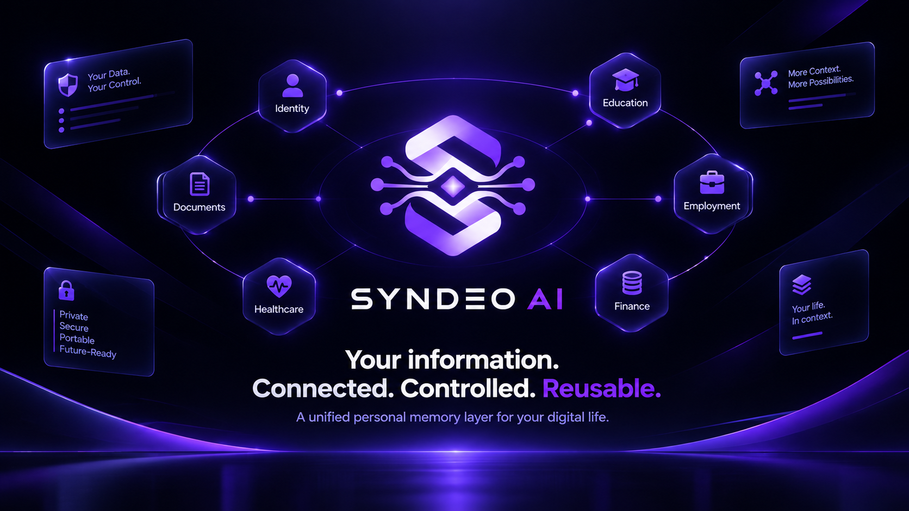

<div align="center">


# SYNDEO ⚡
### A User-Controlled Personal Data Layer & Obsidian Graph Memory



<br />

[](https://fastapi.tiangolo.com)
[](https://react.dev)
[](https://www.typescriptlang.org/)
[](https://neo4j.com/)
[](https://ai.google.dev/)
[](https://sarvam.ai/)
[](https://supabase.com/)

<p align="center">
  <b>A user-controlled personal data layer.</b> Upload documents once, turn them into evidence-linked memory, then reuse it to ask questions, autofill web forms, and share only what's needed.
</p>

> **AI proposes → rules enforce → user approves → audit records.**

</div>

---

## 1. Idea

**Problem:** Personal info is scattered across marksheets, resumes, certificates, and portals. People re-upload, retype, and over-share every time.

**Solution:** Extract facts from documents into **claims**, link each to its **evidence**, and reuse them three ways:

1. **Ask:** chat over your own records (answers show source + assurance)
2. **Autofill:** Chrome extension fills web forms after your approval
3. **Share:** scoped, expiring, revocable links/QR codes exposing only chosen fields

**Not:** a chatbot, cloud drive, blockchain identity, or an AI that decides truth or permissions.

---

## 2. Principles

1. AI recommends, rules enforce, user decides.
2. Claim is the central object; every claim has provenance.
3. Policy runs **before** the LLM; the LLM only sees authorized claims.
4. Minimum disclosure by default; no silent overwrites.
5. Honest trust labels: never say "verified" without a real issuer.
6. Documents, web labels, and chat text are data, never instructions.
7. The extension never submits forms.
8. PostgreSQL is the source of truth; Neo4j is a derived layer.

---

## 3. Features

| Area | Features |
| :--- | :--- |
| **Memory** | Claims with source + assurance, versioning (v1 → v2, history kept), lifecycle states, sensitivity tiers |
| **Ingestion** | Hardened upload, async job states, OCR + extraction, confirmation screen for low-confidence fields |
| **Resolver** | NEW / MATCH / CONFLICT / SUPERSEDE, name/DOB/institution normalization, Conflict Center |
| **Ask** | Authorized-claims-only answers; states: from evidence / from user / conflicting / unknown; Question Agent stores missing info as USER_ASSERTED |
| **Autofill** | Metadata-only scan, READY / AMBIGUOUS / UNAVAILABLE, per-origin approval, "Why was this filled?", logged fills |
| **Sharing** | Immutable snapshots, claim vs evidence permissions, hashed tokens, QR, expiry, instant revoke, proof receipt |
| **Control** | Deterministic Policy Engine, hash-chained audit log, security test suite |
| **Graph** | Neo4j view of Person → Education/Employment/Social → Claim → Evidence |

---

## 4. Quick Start & Local Setup 🚀

Follow these steps to run the complete SYNDEO ecosystem (Web Application, FastAPI Multi-Agent Backend, and Chrome Autofill Extension) locally.

### Prerequisites
- **Node.js** v20.x or later (`node -v`)
- **Python** 3.11.x (`python --version`)
- **Git**
- **Google Chrome** or Chromium-based browser (for the Extension)
- *(Optional)* [Neo4j AuraDB Free Instance](https://neo4j.com/cloud/platform/aura-graph-database/) & [Google Gemini API Key](https://aistudio.google.com/)

---

### Step 1: Clone the Repository

```bash
git clone https://github.com/indresh404/SYNDEO.git
cd SYNDEO
```

---

### Step 2: Backend Setup (FastAPI Multi-Agent Server)

1. Navigate to the project root and create a Python virtual environment:
   ```bash
   # Windows
   python -m venv venv
   .\venv\Scripts\activate

   # macOS / Linux
   python3 -m venv venv
   source venv/bin/activate
   ```

2. Install backend dependencies:
   ```bash
   pip install -r backend/requirements.txt
   ```

3. Configure environment variables:
   ```bash
   # Copy the example environment template
   cp backend/.env.example backend/.env
   ```
   Open `backend/.env` and provide your credentials (the system also provides offline in-memory graph fallbacks if Neo4j is not configured):
   ```ini
   # Neo4j Graph Database (Optional: falls back to in-memory graph store)
   NEO4J_URI=neo4j+s://your-instance.databases.neo4j.io
   NEO4J_USERNAME=neo4j
   NEO4J_PASSWORD=your_neo4j_password

   # AI Inference & OCR (Optional: falls back to local deterministic regex engine)
   GEMINI_API_KEY=your_gemini_api_key
   SARVAM_API_KEY=your_sarvam_api_key
   HUGGINGFACE_API_TOKEN=your_huggingface_token
   PORT=8000
   ```

4. Launch the FastAPI server:
   ```bash
   python backend/main.py
   # Or using uvicorn directly:
   uvicorn backend.main:app --reload --host 127.0.0.1 --port 8000
   ```
   - **Backend API**: `http://127.0.0.1:8000`
   - **Interactive API Docs (Swagger)**: `http://127.0.0.1:8000/docs`
   - **Health & Neo4j Connectivity**: `http://127.0.0.1:8000/api/health`

---

### Step 3: Frontend Setup (React 19 + Vite + Tailwind)

1. In a new terminal window, install frontend dependencies:
   ```bash
   npm install
   ```

2. Start the Vite development server:
   ```bash
   npm run dev
   ```
   - Open your browser at: `http://localhost:5173`

---

### Step 4: Chrome Extension Setup (MemoryFill Autofill)

1. Open Google Chrome and navigate to `chrome://extensions/`
2. Enable **Developer mode** using the toggle switch in the top-right corner.
3. Click the **"Load unpacked"** button in the top-left.
4. Select the `extension/` directory inside your cloned `SYNDEO` repository (`D:/path/to/SYNDEO/extension`).
5. Click the puzzle icon in Chrome and **pin** the **SYNDEO MemoryFill** extension.
6. Navigate to any web form (e.g. Google Forms, job portal, college registration) and click the extension popup to scan and autofill!

---

### Step 5: Running Tests & Quality Verification

```bash
# Run Backend Security & Document Intelligence Test Suite (14 tests)
pytest backend/test_document_intelligence.py -v

# Run Frontend Type-Check & Production Build
npm run build

# Run Frontend Linter
npm run lint
```

---

## 5. Architecture

```text
        React / Vite Web App           Chrome Extension (MV3)
                 └──────────┬──────────┘
                            ▼
                   FastAPI (AuthN, rate limit)
                            ▼
                   AuthZ (BOLA + field-level)
                            ▼
                  POLICY ENGINE (no AI)
                            ▼
                Orchestrator (Python router)
          ┌─────────────────┼─────────────────┐
     Document           Query            MemoryFill
     Workflow          Workflow           Workflow
          └─────────────────┼─────────────────┘
                            ▼
                Memory Service (all writes)
        ┌───────────────────┼───────────────────┐
   PostgreSQL           Object Storage       Audit Log
 (system of record)     (PDFs/images)       (hash chain)
        │ outbox + sync worker
        ▼
      Neo4j (derived relationship layer)
```

**Trust boundary:** AI output is a proposal only. If the AI is compromised or manipulated, the Policy Engine still blocks anything outside user consent and scope.

**Write path:** `LLM → JSON → Pydantic validation → Resolver → Policy → User confirms → Memory Service → DB`

**Agentic design:** three bounded AI components (Document Intelligence, Query Intelligence, MemoryFill). They interpret and propose; everything else (Policy, Resolver, Share, Audit, Integrity) is deterministic code.

---

## 6. Data Model

**Claim** (central object): `claim_id, person_id, field, value, source, assurance, status, version, supersedes, valid_from, valid_to`

| Source | Assurance |
| :--- | :--- |
| USER_INPUT, DOCUMENT, IMPORT, ISSUER | USER_ASSERTED → EVIDENCE_ATTACHED → ISSUER_VERIFIED (+ NEEDS_REVIEW) |

- "Documents agree" is a `consistency_flag`, not a trust level.
- **Lifecycle:** PROPOSED → USER_REVIEW → CONFIRMED → ACTIVE → SUPERSEDED → ARCHIVED
- **Field types:** time-versioned (address, employer), singular (DOB, legal name), multi-valued (skills, links)
- **Sensitivity:** LOW (name, GitHub) · MEDIUM (email, phone, education) · HIGH (DOB, address) · RESTRICTED (medical, financial, gov IDs)

**Other entities:** Person, Evidence (file pointer + SHA-256), Share, ShareSnapshot, ConsentRecord, ApprovedOrigin, AuditEvent.

---

## 7. Storage and Neo4j

| Store | Role |
| :--- | :--- |
| **PostgreSQL (Supabase)** | System of record: claims, shares, snapshots, consent, audit |
| **Neo4j** | Derived layer for multi-hop relationship and provenance queries |
| **Object storage** | Private evidence files |

**Rules:**

- Authorization never depends on Neo4j; the Policy Engine reads Postgres only.
- Writes go to Postgres first, then reach Neo4j through a **transactional outbox**.
- Neo4j stores IDs, field names, assurance, status, and hashes. **Sensitive values stay in Postgres.**
- The graph can be dropped and rebuilt at any time.
- Deleting a user or claim also deletes the graph nodes.

### Graph model

```text
(Person)-[:HAS_EDUCATION]->(Education)-[:AT]->(Institution)
(Person)-[:HAS_EMPLOYMENT]->(Employment)-[:AT]->(Company)
(Person)-[:HAS_SOCIAL]->(Social)
(Person|Education|Employment|Social)-[:HAS_CLAIM]->(Claim)
(Claim)-[:SUPPORTED_BY]->(Evidence)
(Claim)-[:SUPERSEDES]->(Claim)
(Claim)-[:CONFLICTS_WITH]->(Claim)
```

### Sync (outbox pattern)

```text
Memory Service: write claim + insert graph_outbox row (same transaction)
Sync worker:    read unprocessed rows → idempotent MERGE into Neo4j → mark processed
```

### Connection

```bash
NEO4J_URI=neo4j+s://<instance>.databases.neo4j.io   # local: bolt://localhost:7687
NEO4J_USER=neo4j
NEO4J_PASSWORD=<secret>
```

```python
# pip install neo4j
import os
from neo4j import GraphDatabase

driver = GraphDatabase.driver(
    os.environ["NEO4J_URI"],
    auth=(os.environ["NEO4J_USER"], os.environ["NEO4J_PASSWORD"]),
)
driver.verify_connectivity()   # call on FastAPI startup

def run_read(query, **params):
    with driver.session() as s:
        return s.execute_read(lambda tx: list(tx.run(query, **params)))
```

### Key queries (parameterized, scoped by `person_id` from the JWT)

```cypher
// Evidence-backed claims
MATCH (p:Person {person_id:$pid})-[:HAS_CLAIM]->(c:Claim)-[:SUPPORTED_BY]->(e:Evidence)
WHERE c.status='ACTIVE' AND c.assurance IN ['EVIDENCE_ATTACHED','ISSUER_VERIFIED']
RETURN c.claim_id, c.field, c.assurance, e.evidence_id, e.sha256

// Version history of a field
MATCH (p:Person {person_id:$pid})-[:HAS_CLAIM]->(c:Claim {field:$field})
OPTIONAL MATCH path=(c)-[:SUPERSEDES*0..]->(old:Claim)
RETURN c.claim_id, c.version, [n IN nodes(path) | n.claim_id] AS history
```

**Security:** server-side credentials only, TLS, least-privilege DB user, no user-supplied Cypher.

**MVP path:** build on Postgres first (schema is already graph-shaped), add Neo4j when you can show real multi-hop queries (provenance, graph view, conflicts).

---

## 8. Core Workflows

### Document ingestion

```text
Upload → validate + SHA-256 → OCR → classify (rules first) → extract (schema-validated)
→ Resolver → user confirms → Memory Service writes → audit
```

Job states: UPLOADED → PROCESSING → REVIEW_REQUIRED → CONFIRMED / FAILED. OCR text is deleted after extraction.

### Ask

```text
Question → policy check → retrieve authorized claims (Neo4j finds IDs, Postgres supplies values)
→ LLM reasons → answer with source + assurance
Unknown? → Question Agent asks user → stores as USER_ASSERTED
```

### Autofill (extension)

```text
User triggers extension → approves origin → scan visible fields (metadata only)
→ backend maps fields → user selects → values returned → fill locally → user clicks Submit → fill logged
```

- Ambiguous fields are never guessed. High-sensitivity fields are blocked.
- Uses `activeTab`, not `<all_urls>`. Unsupported: iframes, shadow DOM, file inputs.
- A fill sends a raw value to a third party, so it is a logged, approved disclosure.

### Sharing

```text
Request → Disclosure Composer (minimum claims) → Privacy Advisor → Policy check
→ user approves → snapshot share → /s/<token>
```

- **Snapshots** are immutable; later memory edits don't change an existing share.
- **Claim sharing and evidence sharing are separate permissions.**
- Only the token **hash** is stored; every access re-checks expiry, revocation, and scope.
- Out-of-scope request → `403 OUT_OF_SCOPE`. Revoke → `403 SHARE_REVOKED` and the snapshot is deleted.
- Bearer link (default) or recipient-bound (email OTP).
- **Disclosure Composer** produces a minimum claim package, not a cryptographic proof.

---

## 9. Policy Engine and Audit

**Policy Engine** (deterministic Python) checks: authentication, ownership, token validity, revocation, expiry, field scope, sensitivity, minimum assurance, consent. It runs before the LLM sees data and again before state changes.

**Audit log:** structured events (upload, confirm, share created/accessed/denied/revoked, fill, delete). No raw sensitive values. Hash-chained: `H(n) = SHA256(H(n-1) || event)`. Described as **tamper-evident**, never tamper-proof. External anchoring of the chain head comes in v1.5.

---

## 10. Security

- Supabase Auth → verified JWT is the only identity source; `person_id` resolved server-side.
- BOLA and field-level authorization; implement and test real RLS (note: the service-role key bypasses RLS).
- Upload validation by file signature, size limits, private bucket, signed URLs, no URL import (SSRF).
- Rate limits on login, upload, query, share create/access. Idempotency keys on sensitive POSTs.
- LLM gets minimum context; untrusted text is data, with fixed prompts and strict JSON schemas.
- **Tests:** BOLA, cross-user memory, expired/revoked share, out-of-scope field, snapshot immutability, token guessing, prompt injection, malicious upload, extension origin, audit tamper, graph rebuild.

---

## 11. API (`/api/v1`)

| Group | Endpoints |
| :--- | :--- |
| **Documents** | `POST /documents`, `GET /documents/{id}/proposals`, `POST /documents/{id}/confirm` |
| **Memory** | `GET /memory`, `PATCH /memory/claims/{id}`, `GET /conflicts`, `POST /conflicts/{id}/resolve` |
| **Graph** | `GET /graph`, `GET /graph/claims/{id}/provenance` |
| **Query** | `POST /query` |
| **Extension** | `POST /extension/origins`, `/extension/map`, `/extension/fill`, `/extension/fill-log` |
| **Sharing** | `POST /shares/suggest`, `POST /shares`, `GET /shares`, `POST /shares/{id}/revoke`, `GET /s/{token}` |
| **Audit** | `GET /audit`, `GET /audit/verify` |

Errors: `401 UNAUTHENTICATED`, `403 FORBIDDEN / OUT_OF_SCOPE / SHARE_REVOKED / SHARE_EXPIRED / SENSITIVE_NOT_APPROVED`, `422 INSUFFICIENT_ASSURANCE`, `429 RATE_LIMITED`.

---

## 12. Tech Stack

| Layer | Technology |
| :--- | :--- |
| **Frontend** | React 19, TypeScript, Tailwind CSS, Lucide Icons, Vite |
| **Backend** | Python 3.11, FastAPI, Pydantic v2 |
| **AI** | Google Gemini Flash Lite (`gemini-flash-lite-latest`), Sarvam AI (Speech/TTS) |
| **OCR** | PyMuPDF, Tesseract OCR |
| **Data** | Supabase PostgreSQL (source of truth), Neo4j Aura (derived relationship graph) |
| **Storage / Auth** | Supabase Storage, Supabase Auth |
| **Extension** | Chrome Manifest V3 (TypeScript & DOM Injection Engine) |
| **Deploy** | Vercel, Render / Railway, Supabase Cloud, Neo4j Aura |

---

## 13. Roadmap

| Phase | Scope |
| :--- | :--- |
| **MVP** | Auth, claims + evidence, upload → confirm → memory, Resolver, Ask, extension autofill, snapshot shares with expiry/revoke/QR, Policy Engine, audit chain, security tests, Neo4j graph view |
| **v1.5** | Question Agent polish, employment records, mock issuer (ISSUER_VERIFIED demo), external audit anchor, MFA |
| **Later** | DigiLocker / Account Aggregator / W3C VC / SD-JWT, local-first encrypted vault, verifier accounts, finance + healthcare |

**Not in MVP:** blockchain, agent swarm, microservices, healthcare/finance/gov-ID demos, auto-submit.

---

## 14. Honest Limitations

- Hashing proves "unchanged since upload," not "genuine."
- Without an issuer integration, claims are user-provided or evidence-linked, not certified.
- Cloud-first: the operator and LLM vendor can see plaintext during processing.
- Bearer links work for whoever holds them. Revocation stops future access only.
- The audit log is tamper-evident, not tamper-proof.
- Autofill sends raw values to third-party sites; some form types are unsupported.
- MVP data (name, GitHub, college) is low-sensitivity, so the main value is reuse, not secrecy.
- Neo4j is eventually consistent; security decisions never rely on it.

---

## 15. Demo Flow

1. Upload marksheet → AI extracts → user confirms → stored with evidence hash
2. Graph view shows Person → Education → Claim → Evidence
3. Ask "What's my CGPA?" → answer with source + assurance
4. Autofill a job form → ambiguous field flagged → user approves and submits → fill logged
5. Share education + GitHub with a recruiter for 24 hours (link + QR)
6. Recruiter requests CGPA → `403 OUT_OF_SCOPE`; user revokes → `403 SHARE_REVOKED`
7. Audit chain verifies; show a tampered event breaking it

---

### SYNDEO in One Line
> **Reusable, evidence-linked, user-controlled memory that can be asked, autofilled, and selectively shared, with AI proposing and deterministic rules enforcing.**

**Core Flow:**
```text
Upload → Extract → Confirm → Remember → Ask → Autofill → Share → Revoke → Audit
```

**Architecture Principle:**
```text
AI proposes → Policy validates → User approves → Extension/Service executes → Audit records
```
