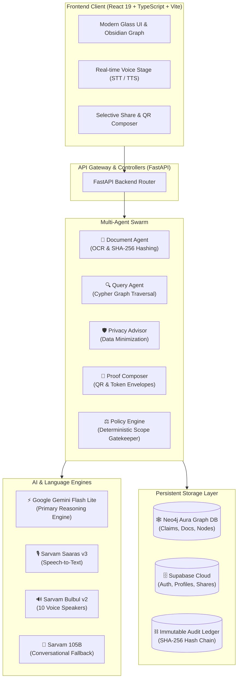

<div align="center">

# SYNDEO ⚡
### Privacy-Preserving Personal Identity, Obsidian Graph Memory & Multi-Agent Network


<br />

[](https://fastapi.tiangolo.com)
[](https://react.dev)
[](https://www.typescriptlang.org/)
[](https://neo4j.com/)
[](https://ai.google.dev/)
[](https://sarvam.ai/)
[](https://supabase.com/)

<p align="center">
  <b>SYNDEO</b> is an enterprise-grade, policy-governed personal data vault and multi-agent system. It transforms fragmented life documents (identity, academic, financial, employment, healthcare) into an immutable, cryptographically verifiable <b>Obsidian Knowledge Graph</b> with granular, zero-knowledge selective disclosure.
</p>

</div>

---

## 🌟 Key Highlights

- 🧠 **Neo4j Aura Multi-Hop Knowledge Graph**: Every verified claim is mapped as a relational node linked to cryptographic document hashes with `LEVEL_1_USER_ASSERTED` and `LEVEL_2_EVIDENCE_ATTACHED` assurance scoring.
- ⚡ **Ultra-Fast Multimodal AI Reasoning**: Powered by **Google Gemini 2.5 (`gemini-flash-lite-latest`)** with sub-1.4s response times, grounded directly in verified vault claims with zero hallucination.
- 🎙️ **Real-Time Word-by-Word Voice Chat**: Live dual-channel speech-to-text with instantaneous interim browser recognition, animated sonic wave stages, and **10 Indian Sarvam Bulbul TTS voice personas** across 12 languages.
- 🛡️ **Autonomous Multi-Agent Swarm**: 5 specialized deterministic and reasoning agents (Document Agent, Query Agent, Privacy Advisor, Proof Composer, and Policy Gatekeeper).
- 🔐 **Selective Disclosure & Instant Revoke**: Create time-bounded, field-level access tokens and tamper-evident QR codes with cryptographic proof envelopes. Revoke access instantly with 1 click.
- 🧼 **Clean Vault Architecture**: Zero fake data by default. Live Neo4j persistence with on-demand **"Load Demo Vault"** toggles for evaluators.
- 🚀 **One-Click Guest Auth**: Skip Google OAuth instantly to explore the interactive vault, knowledge graph, and AI assistant.

---

## 🏛️ System Architecture



---

## 🤖 The Multi-Agent Swarm

| Agent | Responsibility | Core Mechanism |
| :--- | :--- | :--- |
| **Document Agent** | Ingestion & Extraction | Extracts text from PDF/images, computes SHA-256 document evidence hash, classifies into life stages, and creates linked Neo4j claim nodes. |
| **Query Agent** | Graph-First Retrieval | Translates questions into keyword and Cypher graph queries, scoring claims by provenance and cryptographic assurance levels. |
| **Privacy Advisor** | Risk Minimization | Inspects inbound partner requests, suggests field redactions or numeric-to-range transformations, and prevents excessive disclosure. |
| **Proof Composer** | Cryptographic Envelopes | Generates time-bounded HMAC tokens, Merkle proofs, and tamper-evident QR code payloads for verifiers. |
| **Policy Engine** | Deterministic Gatekeeper | Non-LLM rule engine strictly enforcing field scopes (`403 OUT_OF_SCOPE`), expiry (`403 SHARE_EXPIRED`), and revocations (`403 SHARE_REVOKED`). |
| **Audit Logger** | Provenance Integrity | Cryptographically logs every query, disclosure, and access attempt in a verifiable SHA-256 chained ledger. |

---

## 🚀 Quickstart Guide

### Prerequisites
- **Node.js**: v18.0 or higher
- **Python**: v3.10 or higher
- **Package Managers**: `npm` and `pip`

---

### 1. Clone the Repository
```bash
git clone https://github.com/indresh404/SYNDEO.git
cd SYNDEO
```

---

### 2. Configure Environment Variables

#### Root / Frontend (`.env`):
```env
VITE_API_URL=http://127.0.0.1:8000
VITE_SUPABASE_URL=https://your-supabase-project.supabase.co
VITE_SUPABASE_ANON_KEY=your-supabase-anon-key
```

#### Backend (`backend/.env`):
```env
# Google Gemini API
GEMINI_API_KEY=your-gemini-api-key

# Sarvam AI (STT / TTS / LLM)
SARVAM_API_KEY=your-sarvam-api-key

# Neo4j Aura Graph Database
NEO4J_URI=neo4j+s://your-instance.databases.neo4j.io
NEO4J_USERNAME=neo4j
NEO4J_PASSWORD=your-neo4j-password

# Supabase Storage & Database
SUPABASE_URL=https://your-supabase-project.supabase.co
SUPABASE_ANON_KEY=your-supabase-anon-key
```

---

### 3. Run Backend (FastAPI)
```bash
cd backend
python -m venv venv
# Windows:
.\venv\Scripts\activate
# Linux/macOS:
source venv/bin/activate

pip install -r requirements.txt
python -m uvicorn main:app --reload --port 8000
```
Backend will be live at `http://127.0.0.1:8000` (API Docs at `http://127.0.0.1:8000/docs`).

---

### 4. Run Frontend (React + Vite)
```bash
# In the root project directory:
npm install
npm run dev
```
Frontend will be live at `http://localhost:5173`.

---

## 🛠️ Tech Stack

- **Frontend**: React 19, TypeScript, Vite 8, Tailwind CSS, Framer Motion, Lucide Icons, Obsidian Force Graph Engine.
- **Backend API**: Python 3.11, FastAPI, Uvicorn, Pydantic, HTTPX, PyPDF2 / Tesseract OCR.
- **AI & Speech**: Google Gemini 2.5 (`gemini-flash-lite-latest`), Sarvam AI (`saaras:v3` STT, `bulbul:v2` TTS, `sarvam-105b`).
- **Graph & Databases**: Neo4j AuraDB (Cypher Query Language), Supabase (PostgreSQL + Auth + Storage).
- **Deployment**: Vercel (Frontend Client) + Render (FastAPI Microservice).

---

## 📄 License & Attribution

Built for the **SYNDEO Network**. Licensed under the [MIT License](LICENSE).
For project status and remaining roadmap items, check **[STATUS.md](STATUS.md)**.
